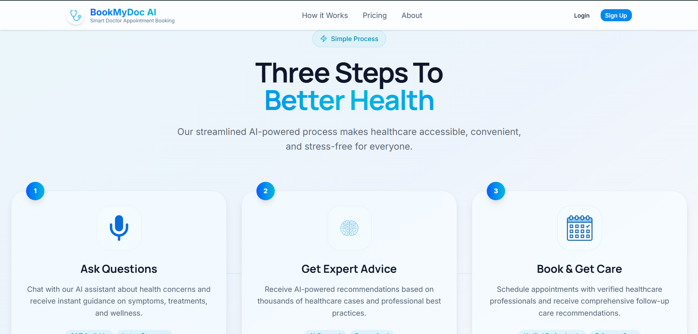
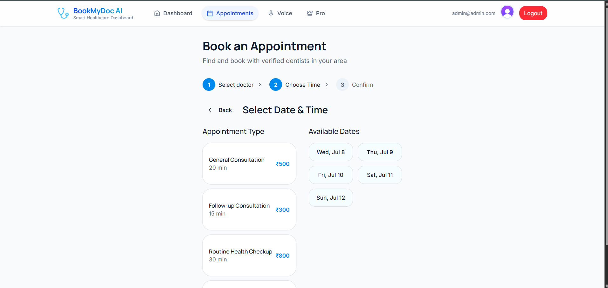
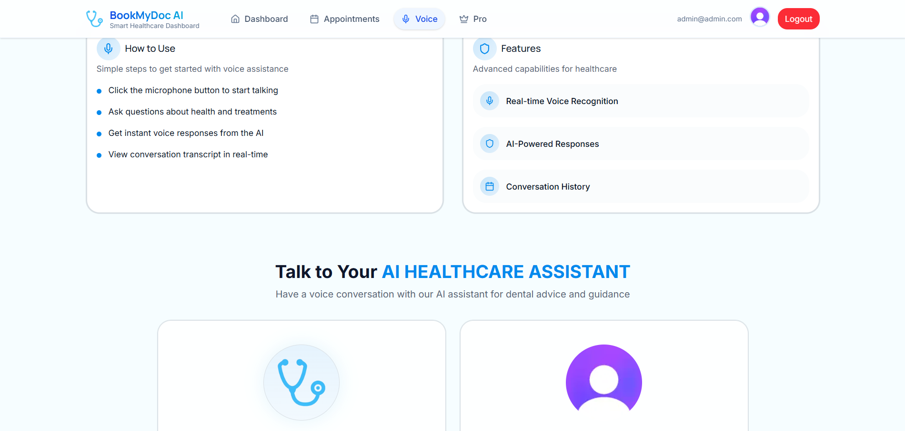
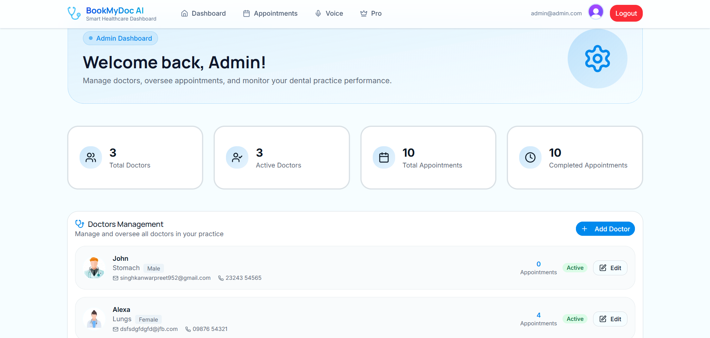
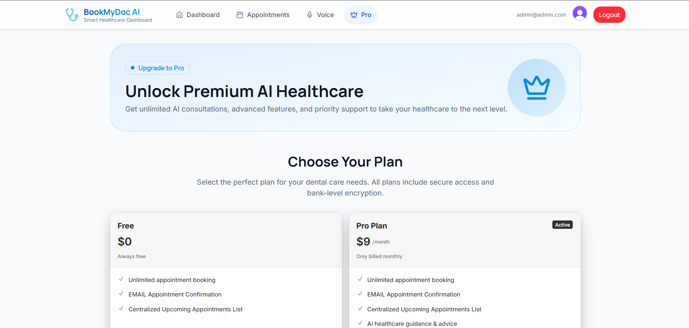

# AI Doctor Appointment Booking Platform

A modern AI-powered doctor appointment platform built with **Next.js**, **Clerk**, **PostgreSQL**, **Prisma**, **Vapi AI**, **Resend**, **TanStack Query**, and **Tailwind CSS**.

Users can securely create an account, book appointments through an intuitive 3-step flow, receive email confirmations and invoices, subscribe to premium plans, and interact with an AI Voice Agent for a smarter healthcare experience.

🌐 **Live Demo:** https://book-my-doc-ai.vercel.app

---

## ✨ Features

- 🏠 Modern responsive landing page
- 🔐 Authentication with Clerk
  - Google Sign-In
  - Email & Password
- ✉️ Email verification with 6-digit OTP
- 📅 Doctor appointment booking system
- 🦷 Simple 3-step booking flow
  - Select Doctor
  - Choose Service & Time
  - Confirm Appointment
- 📩 Booking confirmation emails using Resend
- 🧾 Automatic invoice emails
- 📊 Admin dashboard for appointment management
- 🗣️ AI Voice Agent powered by Vapi *(Pro Plans only)*
- 💳 Subscription plans
  - Free
  - Pro
- 📂 PostgreSQL database with Prisma ORM
- ⚡ Fast server state management using TanStack Query
- 🎨 Beautiful responsive UI using Tailwind CSS & shadcn/ui
- 🚀 Deployed on Vercel
- 🧑‍💻 Clean Git & GitHub workflow

---

# 📸 Screenshots

## 🏠 Landing Page




---

## 📅 Appointment Booking




---

## 🤖 AI Voice Agent




---

## 📊 Admin Dashboard




---

## 💳 Pricing Plans




---

# 🛠️ Tech Stack

### Frontend

- Next.js
- React
- TypeScript
- Tailwind CSS
- shadcn/ui
- TanStack Query

### Backend

- Next.js Server Actions
- Prisma ORM
- PostgreSQL

### Authentication

- Clerk

### AI

- Vapi AI

### Emails

- Resend

### Deployment

- Vercel

---

# 🚀 Getting Started

## 1. Clone the repository

```bash
git clone https://github.com/singh-kanwarpreet/BookMyDoc-AI.git

cd your-repository
```

## 2. Install dependencies

```bash
npm install
```

## 3. Create a `.env` file

```env
NEXT_PUBLIC_CLERK_PUBLISHABLE_KEY=your_clerk_publishable_key
CLERK_SECRET_KEY=your_clerk_secret_key

DATABASE_URL=your_postgres_database_url

NEXT_PUBLIC_VAPI_ASSISTANT_ID=your_vapi_assistant_id
NEXT_PUBLIC_VAPI_API_KEY=your_vapi_api_key

ADMIN_EMAIL=your_admin_email

RESEND_API_KEY=your_resend_api_key

NEXT_PUBLIC_APP_URL=your_app_url
```

## 4. Run the application

```bash
npm run dev
```

Visit

```
http://localhost:3000
```

---

# 👨‍💼 Demo Admin Account

A demo admin account is available on the deployed application.

### Login Credentials

**Email**

```text
admin@admin.com
```

**Password**

```text
Admin@12#343
```

After logging in, visit:

```
https://book-my-doc-ai.vercel.app/admin
```

or simply navigate to

```
/admin
```

to access the Admin Dashboard.

> **Note:** This account is provided for demonstration purposes.

---

# 📁 Project Structure

```text
.
├── app
├── components
├── hooks
├── lib
├── prisma
├── public
└── screenshots
```

---

# 🚀 Deployment

The application is deployed on **Vercel**.

Live URL:

https://book-my-doc-ai.vercel.app

---

# 🔮 Future Improvements

- 📅 Google Calendar integration
- 💬 SMS appointment reminders
- 🎥 Video consultations
- 👨‍⚕️ Doctor availability management
- 📋 Patient medical history
- ⭐ Doctor ratings & reviews

---

# ⭐ Show Your Support

If you found this project helpful, please consider giving it a **⭐ Star** on GitHub.

It helps others discover the project and motivates future improvements.

---


